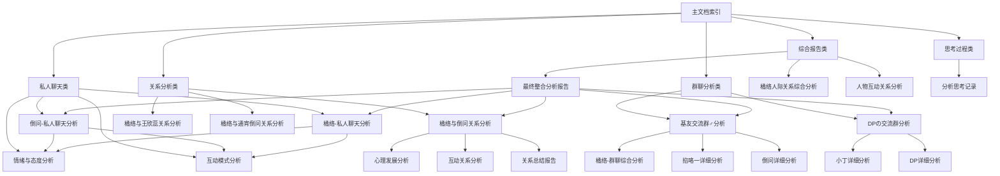

# 详细人物分析文档库

## 📚 文档总览

本文档库包含对橘络及其社交网络中主要人物的全面分析，涵盖群聊互动、私人关系、情感表达等多个维度。

## 📂 分类导航

### 📋 文档分类

### 综合报告类
- [最终整合分析报告](./final-integrated-analysis-report.md) - 671天1400+条消息的全面分析
- [橘络人际关系综合分析报告](./juluo-relationship-analysis.md) - 多维度人际关系评估
- [人物互动关系分析](./character-interaction-analysis.md) - 社交网络结构分析

### 群聊分析类
- [DPの交流群分析文档](./dp-chat-group/README.md) - 技术导向型群聊分析
- [基友交流群♂分析文档](./bros-chat-group/README.md) - 社交导向型群聊分析

### 思考过程类
- [思考过程文档](./thinking-process/README.md) - 分析逻辑和推理路径记录

### 私人聊天类
- [私人聊天分析](./private-chat/README.md) - 个人间私密交流分析

### 文档工具类
- [文档导航地图](./document-navigation-map.md) - 完整文档索引和导航系统
- [文档模板](./document-template.md) - 统一的分析文档格式标准

## 🗂️ 文档分类

### 1. 综合报告类
- [最终整合分析报告](./final-integrated-analysis-report.md) - 全面整合所有分析结果
- [橘络人际关系综合分析报告](./juluo-relationship-analysis.md) - 橘络社交网络分析
- [人物互动关系分析](./character-interaction-analysis.md) - 群聊与私人互动模式

### 2. 群聊分析类

#### DPの交流群
- [DP详细分析文档](./dp-chat-group/dp-detailed-analysis.md)
- [小丁详细分析文档](./dp-chat-group/xiaoding-detailed-analysis.md)
- [互动模式分析](./dp-chat-group/dp-chat-group-interaction-patterns.md)
- [情绪与态度分析](./dp-chat-group/dp-chat-group-emotions-attitudes.md)
- [核心主题与高频词分析](./dp-chat-group/dp-chat-group-themes-keywords.md)

#### 基友交流群♂
- [倒问详细分析文档](./bros-chat-group/dowen-detailed-analysis.md)
- [掐咯一详细分析文档](./bros-chat-group/qialuoyi-detailed-analysis.md)
- [爱意随风起详细分析文档](./bros-chat-group/aiyisuifengqi-detailed-analysis.md)
- [橘络-群聊综合分析](./bros-chat-group/juluo-group-chat-analysis.md)
- [互动模式分析](./bros-chat-group/bros-chat-group-interaction-patterns.md)
- [情绪与态度分析](./bros-chat-group/bros-chat-group-emotions-attitudes.md)
- [核心主题与高频词分析](./bros-chat-group/bros-chat-group-themes-keywords.md)

### 3. 关系分析类

#### 橘络与倒问关系分析
- [关系分析总结报告](./juluo-dowen-relationship-analysis/juluo-dowen-relationship-summary.md)
- [互动关系分析](./juluo-dowen-relationship-analysis/juluo-dowen-interaction-analysis.md)
- [心理发展综合分析](./juluo-dowen-relationship-analysis/juluo-dowen-psychological-analysis.md)
- [关系发展时间线分析](./juluo-dowen-relationship-analysis/juluo-dowen-timeline-analysis.md)
- [数据可视化与量化分析](./juluo-dowen-relationship-analysis/juluo-dowen-data-visualization-analysis.md)
- [关系维护与发展指南](./juluo-dowen-relationship-analysis/juluo-dowen-relationship-guide.md)

#### 其他关系分析
- [橘络与王欣蕊关系分析报告](./juluo-wangxinrui-relationship-analysis.md)
- [橘络与通宵倒问关系分析报告](./juluo-overnight-dowen-relationship-analysis.md)
- [橘络与长亭落雨外关系分析报告](./juluo-changting-luoyuwai-relationship-analysis.md)
- [橘络与Happy、巧克力关系分析报告](./juluo-happy-chocolate-relationship-analysis.md)

### 4. 私人聊天分析
- [倒问-私人聊天分析](./private-chat/dowen-private-chat-analysis.md)
- [橘络-私人聊天分析](./private-chat/juluo-private-chat-analysis.md)
- [互动模式分析](./private-chat/private-chat-interaction-patterns.md)
- [情绪与态度分析](./private-chat/private-chat-emotions-attitudes.md)
- [核心主题与高频词分析](./private-chat/private-chat-themes-keywords.md)

### 5. 社交关系综合分析
- [橘络社交关系全景分析报告](./juluo-social-relationship-panorama.md)
- [橘络社交关系综合对比分析报告](./juluo-social-relationship-comparison.md)
- [橘络人际关系综合分析报告](./juluo-relationship-analysis.md)

### 6. 聊天记录分析
- [聊天记录综合分析报告](./chat-records-comprehensive-analysis.md)
- [聊天记录综合对比分析报告](./chat-records-comparison-analysis.md)

### 7. 思考过程
- [分析思考记录](./thinking-process/analysis-thinking-records.md)

### 8. 特殊人物分析
- [大叔（李宇航）-长亭落雨外详细分析文档](./uncle-liyuhang-changting-analysis.md)

## 📊 分析维度

### 情感分析维度
- 情绪表达模式
- 情感强度变化
- 情感互动特点

### 互动分析维度
- 消息频率统计
- 话题分布特点
- 交流模式识别

### 关系分析维度
- 关系强度评估
- 关系发展轨迹
- 关系维护模式

### 人物特征维度
- 性格特点分析
- 社交行为模式
- 情感表达特点

## 🔍## 🚀 快速导航

| 分类 | 核心文档 | 主要发现 | 相关文档 |
|------|----------|----------|----------|
| 综合报告 | [最终整合分析报告](./final-integrated-analysis-report.md) | 橘络与倒问关系健康，性格互补 | [综合分析](./juluo-relationship-analysis.md) |
| 群聊分析 | [人物互动关系分析](./character-interaction-analysis.md) | 群聊形成不同社交生态 | [DP群分析](./dp-chat-group/README.md), [基友群分析](./bros-chat-group/README.md) |
| 关系分析 | [橘络人际关系综合分析](./juluo-relationship-analysis.md) | 橘络社交网络功能分化明显 | [私人聊天分析](./private-chat/README.md) |
| 私人聊天 | [私人聊天分析](./private-chat/README.md) | 情感表达丰富，关系深入 | [倒问分析](./private-chat/dowen-private-chat-analysis.md), [橘络分析](./private-chat/juluo-private-chat-analysis.md) |
| 文档导航 | [文档导航地图](./document-navigation-map.md) | 完整文档索引和导航 | [所有文档索引](./document-navigation-map.md) | 🔗 文档关系图

## 📋 文档交叉引用索引

### 核心人物分析
- **橘络**: [橘络人际关系综合分析](./juluo-relationship-analysis.md) | [橘络-私人聊天分析](./private-chat/juluo-private-chat-analysis.md) | [橘络-群聊综合分析](./bros-chat-group/juluo-group-chat-analysis.md)
- **倒问**: [倒问详细分析](./bros-chat-group/dowen-detailed-analysis.md) | [倒问-私人聊天分析](./private-chat/dowen-private-chat-analysis.md)
- **DP**: [DP详细分析](./dp-chat-group/dp-detailed-analysis.md)

### 关系分析
- **橘络与倒问**: [关系分析总结报告](./juluo-dowen-relationship-analysis/juluo-dowen-relationship-summary.md) | [互动关系分析](./juluo-dowen-relationship-analysis/juluo-dowen-interaction-analysis.md)
- **橘络与王欣蕊**: [关系分析报告](./juluo-wangxinrui-relationship-analysis.md)
- **橘络与通宵倒问**: [关系分析报告](./juluo-overnight-dowen-relationship-analysis.md)

### 群聊分析
- **DPの交流群**: [群聊分析](./dp-chat-group/README.md) | [互动模式分析](./dp-chat-group/dp-chat-group-interaction-patterns.md)
- **基友交流群♂**: [群聊分析](./bros-chat-group/README.md) | [互动模式分析](./bros-chat-group/bros-chat-group-interaction-patterns.md)

### 分析维度
- **互动模式**: [群聊互动模式](./character-interaction-analysis.md) | [私人互动模式](./private-chat/private-chat-interaction-analysis.md)
- **情绪态度**: [群聊情绪分析](./bros-chat-group/bros-chat-group-emotion-analysis.md) | [私人情绪分析](./private-chat/private-chat-emotion-analysis.md)
- **主题词频**: [群聊主题分析](./bros-chat-group/bros-chat-group-topic-analysis.md) | [私人主题分析](./private-chat/private-chat-topic-analysis.md)

## 📈 数据统计

- **总文档数**: 40+ 个分析文档
- **分析时间跨度**: 2024年1月 - 2025年11月
- **涉及人物**: 10+ 个主要人物
- **聊天记录**: 1400+ 条消息分析

## 🔗 相关链接

- [项目主页](../README.md)
- [文档导航](../_sidebar.md)

---

*最后更新: 2025年11月*  
*分析基于真实聊天记录数据*