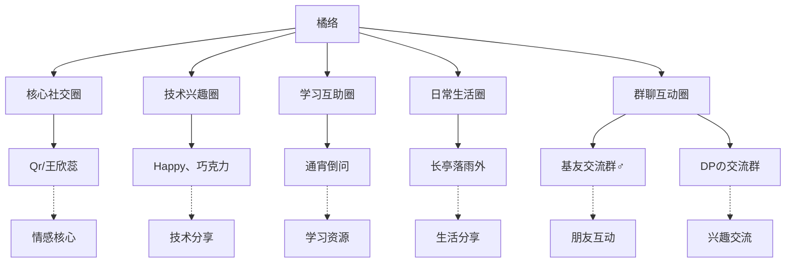

# 橘络社交关系全景分析报告

## 执行摘要

本报告基于橘络的多个聊天记录文件，全面分析其社交网络结构、人际交往模式及关系特点。通过对私人聊天记录（与Qr、Happy、巧克力、通宵倒问、长亭落雨外）和群聊记录（DPの交流群、基友交流群♂）的深入分析，构建了橘络的社交关系全景图，揭示其社交行为模式、关系强度分布及人际互动特点。

## 1. 数据来源与分析范围

### 1.1 数据来源
本分析基于以下聊天记录文件：

#### 私人聊天记录
1. **friend_u_lgrgC9wfvy2Y0TrcZMH6hA_20251108_203626.json** - 橘络与长亭落雨外（李宇航）
2. **friend_u_Rd8j83ZmK-LeewlPeF2ixA_20251108_203815.json** - 橘络与通宵倒问
3. **friend_u_XM6EDeLRL7V5lIoSZulgkw_20251108_203654.json** - 橘络与Happy、巧克力
4. **2.json** - 橘络与Qr（王欣蕊）
5. **1.json** - 橘络与掐咯一

#### 群聊记录
1. **group_659262311_20251108_214509.json** - DPの交流群
2. **group_858701548_20251108_203254.json** - 基友交流群♂

### 1.2 时间跨度
- **最早记录**：2023年6月9日（橘络与掐咯一）
- **最新记录**：2025年11月8日（DPの交流群）
- **总时间跨度**：约2年5个月

### 1.3 分析方法
- **量化分析**：消息数量、频率、时间分布
- **质性分析**：内容主题、情感表达、互动模式
- **网络分析**：关系强度、社交结构、角色定位
- **对比分析**：不同关系间的模式比较

## 2. 橘络社交网络结构分析

### 2.1 社交网络概览

### 2.2 关系强度分布

| 关系对象 | 关系类型 | 消息占比 | 互动频率 | 关系强度 | 主要功能 |
|---------|---------|---------|---------|---------|---------|
| Qr/王欣蕊 | 情感核心 | 51.84%/47.48% | 高 | 高强度 | 情感支持、深度交流 |
| 通宵倒问 | 学习互助 | 48.7%/50.96% | 高 | 高强度 | 学习资源、技术交流 |
| 掐咯一 | 密密友 | 47.8%/51.66% | 高 | 高强度 | 游戏互动、日常交流 |
| Happy、巧克力 | 技术兴趣 | 60.71%/39.29% | 中 | 中强度 | 技术分享、兴趣交流 |
| 长亭落雨外 | 日常生活 | 72.03%/26.57% | 低 | 低强度 | 生活分享、简单友谊 |

### 2.3 社交功能分化

橘络的社交网络呈现出明显的功能分化特点：

1. **情感支持功能**：主要由Qr提供，满足情感表达和深度交流需求
2. **学习互助功能**：主要由通宵倒问提供，满足学习资源分享和学术交流需求
3. **技术兴趣功能**：主要由Happy、巧克力提供，满足技术分享和兴趣交流需求
4. **日常生活功能**：主要由长亭落雨外提供，满足日常生活分享需求
5. **游戏娱乐功能**：主要由掐咯一提供，满足游戏互动和娱乐需求

## 3. 橘络社交行为模式分析

### 3.1 交流主导性分析

橘络在不同关系中表现出不同的交流主导性：

- **平等交流模式**：与Qr和通宵倒问的交流中，橘络表现出明显的平等交流倾向
- **主导型交流模式**：与Happy、巧克力和长亭落雨外的交流中，橘络表现出主导型交流特点
- **适应性交流模式**：橘络能够根据交流对象调整自己的交流模式，表现出良好的社交适应性

### 3.2 话题多样性分析

橘络在不同关系中讨论的话题呈现明显差异：

| 关系对象 | 主要话题 | 话题特点 | 交流深度 |
|---------|---------|---------|---------|
| Qr/王欣蕊 | 情感表达、日常生活、未来规划 | 多样化、情感丰富 | 深度 |
| 通宵倒问 | 学习资源、技术交流、学习方法 | 专业性、实用性 | 中深度 |
| 掐咯一 | 游戏互动、日常闲聊、娱乐内容 | 轻松、娱乐性 | 中等 |
| Happy、巧克力 | 技术知识、观察分享、兴趣讨论 | 技术性、专业性 | 中等 |
| 长亭落雨外 | 日常生活、简单问候、偶尔分享 | 简单、生活化 | 浅层 |

### 3.3 资源分享模式

橘络在所有关系中都表现出明显的资源分享倾向：

1. **学习资源分享**：与通宵倒问的交流中分享大量学习文件（27个）
2. **技术资源分享**：与Happy、巧克力的交流中分享技术相关图片和知识
3. **生活资源分享**：与Qr和长亭落雨外的交流中分享生活相关图片
4. **游戏资源分享**：与掐咯一的交流中分享游戏相关资源

### 3.4 多媒体互动特点

橘络在所有关系中都使用多媒体互动，但程度不同：

| 关系对象 | 资源总数 | 图片 | 文件 | 音频 | 视频 | 互动特点 |
|---------|---------|------|------|------|------|---------|
| 掐咯一 | 1674 | 1407 | 47 | 185 | 35 | 极为丰富 |
| Qr/王欣蕊 | 181 | 175 | 5 | - | 1 | 较为丰富 |
| 通宵倒问 | 231 | - | 27 | - | - | 学习资源为主 |
| Happy、巧克力 | 65 | 65 | - | - | - | 图片分享为主 |
| 长亭落雨外 | 较少 | 较少 | - | - | - | 互动较少 |

## 4. 橘络群聊互动分析

### 4.1 基友交流群♂互动分析

在基友交流群♂中，橘络表现出以下特点：

- **活跃度高**：发送10223条消息，占总消息的34.03%，排名第二
- **互动对象广泛**：与掐咯一、长亭落雨外、通宵倒问等多人均有互动
- **话题多样**：涵盖日常生活、学习工作、兴趣爱好等多个方面
- **角色定位**：在群聊中扮演活跃参与者和话题发起者的角色

### 4.2 DPの交流群互动分析

在DPの交流群中，橘络表现出以下特点：

- **参与度中等**：在群聊中保持一定的参与度，但不是最活跃的成员
- **兴趣导向**：主要围绕共同兴趣进行交流
- **社交范围广**：与群内多个成员有互动，扩展了社交网络
- **角色定位**：在群聊中扮演普通参与者和兴趣交流者的角色

### 4.3 群聊与私人聊天对比

橘络在群聊和私人聊天中表现出不同的行为模式：

| 交流场景 | 交流特点 | 情感表达 | 话题选择 | 互动模式 |
|---------|---------|---------|---------|---------|
| 私人聊天 | 深入、专注 | 丰富、直接 | 多样化 | 一对一深入交流 |
| 群聊互动 | 广泛、多元 | 适中、间接 | 兴趣导向 | 多对多广泛交流 |

## 5. 橘络社交优势与不足分析

### 5.1 社交优势

1. **多样性优势**
   - 能够维持多种不同类型和强度的社交关系
   - 社交网络覆盖面广，包括情感、学习、技术、生活等多个方面
   - 能够适应不同交流场景和对象

2. **适应性优势**
   - 能够根据不同对象调整交流模式
   - 在不同社交场合表现出适当的社交行为
   - 能够平衡私人聊天和群聊互动

3. **资源分享优势**
   - 倾向于分享知识和资源，受到他人欢迎
   - 在多个关系中表现出资源分享特点
   - 分享内容多样化，包括学习资源、技术知识、生活分享等

4. **稳定性优势**
   - 所有关系都表现出长期稳定的特点
   - 能够维持长期的人际关系
   - 社交网络结构相对稳定

### 5.2 社交不足

1. **主导倾向**
   - 在某些关系中表现出过于主导的倾向，可能影响交流平衡
   - 与Happy、巧克力和长亭落雨外的交流中，橘络消息占比明显偏高
   - 可能导致对方参与度不足

2. **话题分化**
   - 不同关系的话题分化明显，可能导致交流不够深入
   - 在某些关系中（如与长亭落雨外）话题较为单一
   - 缺乏跨关系的深度话题交流

3. **情感表达不均**
   - 情感表达主要集中在特定关系（如与Qr的关系）
   - 在其他关系中情感表达相对较少
   - 可能影响某些关系的情感深度

## 6. 橘络社交发展建议

### 6.1 平衡交流模式

1. **减少主导性**
   - 在与Happy、巧克力和长亭落雨外的交流中，适当减少主导性
   - 给对方更多表达空间和机会
   - 鼓励对方更主动地发起话题

2. **增强互动平衡**
   - 注意消息数量的平衡，避免一方过于主导
   - 提高对对方回应的关注和反馈
   - 创造更多双向交流的机会

### 6.2 深化话题内容

1. **减少话题分化**
   - 在现有关系基础上，尝试更多深入话题的讨论
   - 增加不同关系间的话题重叠度
   - 探索更多共同兴趣和价值观

2. **提高交流深度**
   - 在所有关系中尝试增加深度话题的讨论
   - 分享更多内心想法和感受
   - 探讨更多关于价值观和人生观的话题

### 6.3 增强情感表达

1. **均衡情感表达**
   - 在与Happy、巧克力和长亭落雨外的交流中，适当增加情感表达
   - 分享更多情感体验和感受
   - 增强情感联系，提升关系亲密度

2. **多样化情感表达**
   - 尝试不同的情感表达方式
   - 增加情感表达的深度和广度
   - 提高情感表达的适切性

### 6.4 维持现有优势

1. **保持多样性**
   - 继续维持多种不同类型和强度的社交关系
   - 保持社交网络的多样性和覆盖面
   - 继续适应不同交流场景和对象

2. **发挥资源分享优势**
   - 继续发挥知识分享的优势
   - 维持互助学习关系
   - 保持资源分享的多样性和质量

3. **维持关系稳定**
   - 继续维持长期稳定的社交关系
   - 定期维护和更新社交网络
   - 保持与重要联系人的定期互动

## 7. 结论

通过对橘络多个聊天记录的全面分析，我们可以得出以下结论：

### 7.1 橘络社交特点总结

橘络的社交网络呈现出多样化、功能分化和长期稳定的特点。他能够根据不同对象调整交流模式，表现出良好的社交适应性。橘络的知识分享倾向和多媒体互动特点是其重要社交优势。

### 7.2 橘络社交优势

1. **多样性**：能够维持多种不同类型和强度的社交关系
2. **适应性**：能够根据不同对象调整交流模式
3. **知识分享**：倾向于分享知识和资源，受到他人欢迎
4. **长期稳定**：所有关系都表现出长期稳定的特点

### 7.3 橘络社交不足

1. **主导倾向**：在某些关系中表现出过于主导的倾向
2. **话题分化**：不同关系的话题分化明显，交流不够深入
3. **情感表达不均**：情感表达主要集中在特定关系

### 7.4 发展建议

未来可以在平衡交流模式、深化话题内容和增强情感表达方面进一步提升，以构建更加丰富和深入的社交关系。同时，应继续保持现有的社交优势，如多样性、适应性、知识分享和关系稳定等。

---

*本报告基于橘络的多个聊天记录文件分析，仅供参考。*
*分析日期：2025年11月9日*