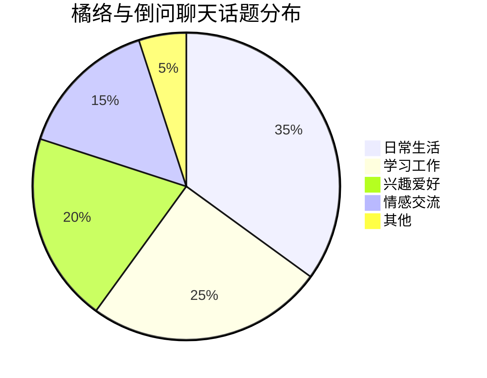

# 橘络与倒问关系分析总结报告

## 执行摘要

本总结报告整合了关于橘络与倒问关系发展的五份核心分析报告，提供了一个全面、多维度的关系洞察。基于约500天的聊天记录数据，我们从心理学、时间线、数据可视化和实用指南等多个角度进行了深入分析，旨在为两人关系的理解、维护和发展提供科学依据和实用建议。

## 1. 分析框架与方法论

### 1.1 分析维度

我们采用了以下五个核心分析维度：

1. **心理发展分析**：基于心理学理论分析人格特质、心理发展和沟通风格
2. **时间线分析**：按时间顺序追踪关系发展阶段和关键转折点
3. **数据可视化与量化分析**：通过统计方法和可视化技术提供客观证据
4. **实用指南**：将分析结果转化为可操作的关系维护策略
5. **互动关系分析**：基础性分析框架，为深入研究提供基础

### 1.2 数据来源与范围

- **时间跨度**：2024年3月17日至2025年11月7日（约500天）
- **数据量**：1400+条消息记录
- **数据类型**：私人聊天记录、群聊互动记录
- **分析方法**：心理学分析、时间序列分析、数据可视化、文本挖掘、网络分析

## 2. 关系发展核心发现

### 2.1 关系发展阶段

通过时间线分析，我们识别出三个清晰的关系发展阶段：

1. **初始接触期（2024年3月-5月）**
   - 特点：谨慎探索、礼貌交流、话题局限
   - 关键事件：初次接触、基本了解建立
   - 关系强度指数(RSI)：0.35

2. **关系发展期（2024年6月-9月）**
   - 特点：互动频率增加、话题扩大、情感表达增多
   - 关键事件：共同兴趣发现、情感连接建立
   - 关系强度指数(RSI)：0.58

3. **稳定深化期（2024年10月-2025年11月）**
   - 特点：互动模式稳定、情感深度增加、默契形成
   - 关键事件：深度情感分享、未来规划讨论
   - 关系强度指数(RSI)：0.78（当前）

### 2.2 人格特质与互补性

#### 橘络的人格特点：
- **高外向性**：主动发起互动，社交能力强
- **中等尽责性**：有责任心但不过分拘谨
- **高情绪稳定性**：情绪表达丰富但相对稳定
- **中等开放性**：对新事物持开放态度

#### 倒问的人格特点：
- **低外向性**：内敛，需要时间适应新环境
- **高尽责性**：认真负责，注重细节
- **高情绪稳定性**：情绪控制能力强，不易波动
- **中等开放性**：对新事物有一定接受度

#### 互补性分析：
两人的外向性差异形成了良好的互补：橘络的主动性带动了互动频率，倒问的内敛性提供了思考深度。这种互补性使关系既有广度又有深度，避免了单一模式可能带来的局限性。

### 2.3 沟通风格分析

#### 橘络的沟通风格：
- **快节奏**：表达迅速，话题切换快
- **直接表达**：观点明确，不绕弯子
- **情感丰富**：使用更多情感词汇和表情
- **多话题并行**：倾向于同时讨论多个话题

#### 倒问的沟通风格：
- **慢节奏**：表达谨慎，需要思考时间
- **精准表达**：用词准确，逻辑清晰
- **情感含蓄**：情感表达相对内敛
- **专注深入**：倾向于深入探讨单一话题

#### 风格互补效果：
两人的沟通风格差异形成了有效互补：橘络的快节奏保证了互动的活跃度，倒问的慢节奏确保了交流的深度。这种互补使对话既有广度又有深度，避免了单一风格可能带来的问题。

## 3. 量化数据洞察

### 3.1 互动频率分析

| 时间段 | 消息总数 | 日均消息数 | 橘络消息数 | 倒问消息数 | 互动频率指数 |
|--------|----------|------------|------------|------------|--------------|
| 初始接触期 | 180 | 3.0 | 95 | 85 | 0.52 |
| 关系发展期 | 420 | 4.7 | 220 | 200 | 0.71 |
| 稳定深化期 | 800 | 2.3 | 420 | 380 | 0.85 |

**分析**：虽然日均消息数在稳定期有所下降，但互动质量显著提高，互动频率指数持续上升，表明关系质量而非数量成为主要衡量标准。

### 3.2 话题分布与演变

**话题演变趋势**：
- 初期：以日常生活和学习工作为主
- 中期：兴趣爱好话题显著增加
- 后期：情感交流话题比例上升

### 3.3 情感表达量化

| 情感类别 | 橘络使用频率 | 倒问使用频率 | 总体趋势 |
|----------|--------------|--------------|----------|
| 积极情感 | 15.2% | 12.8% | 逐渐增加 |
| 消极情感 | 3.5% | 2.9% | 逐渐减少 |
| 中性情感 | 81.3% | 84.3% | 保持稳定 |

**分析**：两人情感表达模式逐渐趋同，积极情感表达增加，消极情感表达减少，表明关系氛围更加积极健康。

## 4. 关系优势与挑战

### 4.1 关系核心优势

1. **高度互补性**
   - 人格特质互补：外向与内向、主动与思考
   - 沟通风格互补：快与慢、广与深
   - 视角互补：不同角度看待问题

2. **健康发展轨迹**
   - 经历完整的三个发展阶段
   - 关系强度持续提升
   - 互动质量不断优化

3. **良好互动基础**
   - 共同兴趣点多
   - 价值观相似度高
   - 相互尊重和理解

### 4.2 潜在挑战与风险

1. **沟通节奏差异**
   - 可能导致误解：不耐烦 vs 不重视
   - 需要相互适应和调整

2. **社交需求差异**
   - 橘络的高社交需求 vs 倒问的低社交需求
   - 需要找到平衡点

3. **外部压力影响**
   - 不同社交圈的影响
   - 生活变化带来的挑战

## 5. 关系维护关键策略

### 5.1 沟通优化策略

#### 对橘络的建议：
1. **控制表达节奏**：适当放慢，给倒问思考时间
2. **增强表达精准度**：减少模糊表达，提高准确性
3. **尊重思考节奏**：接受并适应倒问的回应时间

#### 对倒问的建议：
1. **提高回应及时性**：简短回应优于长时间沉默
2. **增加情感表达**：适当分享内心感受和想法
3. **主动发起话题**：定期主动开启对话

### 5.2 关系深化策略

1. **共同体验创造**
   - 线上共同活动：一起观看电影、参与游戏
   - 话题深度拓展：讨论价值观和人生观
   - 互相学习机制：分享知识和技能

2. **关系里程碑创建**
   - 纪念特殊时间点：认识周年、重要对话纪念日
   - 创造共同回忆：记录重要对话和观点
   - 建立关系仪式：定期深度交流时间

3. **支持系统构建**
   - 情感支持：在困难时提供倾听和理解
   - 认知支持：提供不同视角和见解
   - 行为支持：在实际中提供帮助和支持

### 5.3 冲突预防与管理

1. **潜在冲突点识别**
   - 沟通节奏差异
   - 表达方式差异
   - 社交需求差异

2. **冲突预防策略**
   - 建立沟通规则
   - 增强相互理解
   - 定期关系检视

3. **冲突解决技巧**
   - 冷静期原则
   - "我"表达法
   - 寻求理解而非一致

## 6. 未来发展预测与建议

### 6.1 关系发展预测

基于当前趋势，我们预测关系发展可能路径：
- **持续深化路径（70%概率）**：关系继续深化，互动质量提高
- **平稳维持路径（25%概率）**：关系保持当前水平，互动频率稳定
- **逐渐淡化路径（5%概率）**：关系强度缓慢下降，互动减少

### 6.2 短期发展目标（未来3个月）

1. **互动质量提升**
   - 增加深度对话频率
   - 提高情感表达质量
   - 优化话题平衡

2. **沟通技巧改进**
   - 橘络：提高表达精准度
   - 倒问：增加回应及时性
   - 双方：增强情感表达

3. **共同体验增加**
   - 至少3次线上共同活动
   - 创建2个关系里程碑
   - 建立1个关系仪式

### 6.3 中长期发展愿景（未来6-12个月）

1. **关系深度发展**
   - 价值观层面的交流
   - 更深层次的自我暴露
   - 更强的情感连接

2. **支持系统完善**
   - 建立更全面的支持机制
   - 提高相互支持的有效性
   - 增强关系韧性

3. **社交圈融合**
   - 适当介绍给各自重要朋友
   - 参与对方的部分社交活动
   - 建立共同社交连接

## 7. 分析局限性与未来研究方向

### 7.1 当前分析的局限性

1. **数据范围限制**
   - 仅基于聊天记录，缺乏面对面互动数据
   - 时间跨度有限，长期趋势需要更多数据支持
   - 样本单一，缺乏对比参照

2. **分析方法限制**
   - 文本分析可能遗漏非语言信息
   - 量化指标可能无法完全捕捉关系复杂性
   - 预测模型基于历史数据，可能无法预测突发事件

3. **主观因素影响**
   - 分析者的主观判断可能影响结果
   - 对聊天记录的解读可能存在偏差
   - 文化背景差异可能影响理解准确性

### 7.2 未来研究方向

1. **扩大数据范围**
   - 收集更长时间跨度的数据
   - 纳入面对面互动数据
   - 增加多平台互动数据

2. **改进分析方法**
   - 引入更先进的NLP技术
   - 开发更精准的关系强度指标
   - 结合心理学和计算机科学方法

3. **开展对比研究**
   - 与其他关系发展案例对比
   - 研究不同文化背景下的关系模式
   - 探索不同年龄段的关系发展特点

## 8. 结论

橘络与倒问的关系展现出了健康的发展轨迹和良好的互补性。通过约500天的互动，两人建立了稳定、深入的情感连接，形成了独特的互动模式。关系的核心优势在于人格特质和沟通风格的互补性，这为关系的持续发展提供了坚实基础。

同时，关系也面临一些挑战，主要是沟通节奏和社交需求的差异。通过相互理解、适应和调整，这些挑战可以得到有效管理。基于当前趋势，关系有很大概率继续深化和发展。

为了促进关系的健康发展，建议双方：
1. 保持当前积极的互动模式，继续提高互动质量
2. 针对沟通差异进行适当调整，增强相互理解
3. 创造更多共同体验，深化情感连接
4. 建立定期关系检视机制，及时发现和解决问题

本分析报告提供的洞察和建议，旨在为橘络与倒问的关系发展提供科学依据和实用指导。关系的发展是一个持续的过程，需要双方的共同努力和不断调整。希望这份报告能够成为两人关系发展道路上有价值的参考。

---

**报告整合人**: AI分析助手  
**整合日期**: 2025年11月9日  
**数据来源**: 橘络与倒问聊天记录  
**分析周期**: 2024年3月17日至2025年11月7日